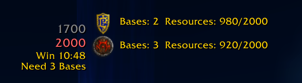
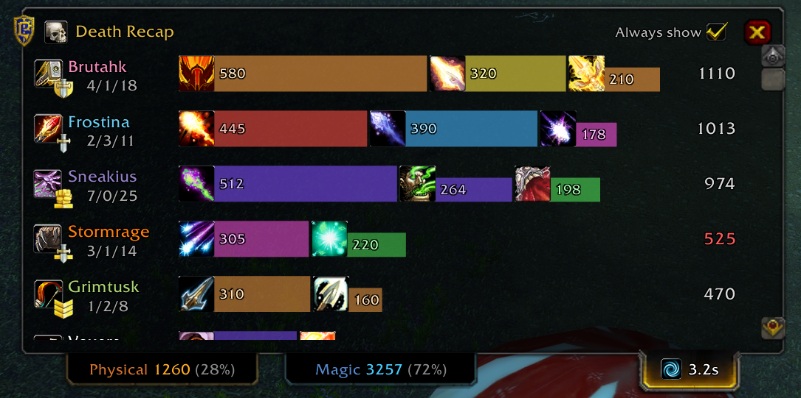

# TurtlePvPEnhanced

A PvP utility addon for **Turtle WoW** (Patch 1.18.1+).

## Features

### Battlegrounds

**Warsong Gulch**
- Flag carrier overlay with live distance tracking for both factions
- Auto-announces flag carrier health to party when they are taking heavy damage

**Arathi Basin**
- Projected score and required bases to win as overlay 

> **Coming soon:** Alterac Valley, Blood Ring, and Thorn Gorge support

### General

**Death Recap**
- See exactly who killed you and what they used
- Know if you died to burst, procs, or CC setup

**Combat**
- Auto-release on death in battlegrounds
- Auto-queue for battlegrounds on login

**Communication**
- Automatically switches chat to `/bg` when you open the chat box inside a battleground

**Gadgets**
- Auto-hide helmet slot when equipping trinket helmets
- Tab-target skips Shaman totems

## Install

**Via the Turtle WoW Launcher**
1. Go to **AddOns → Add new addon** and paste:
   `https://github.com/dnkrse/TurtlePvPEnhanced.git`
2. The launcher keeps it updated automatically.

**Manual**
Place the `TurtlePvPEnhanced` folder in `Interface/AddOns/`.
